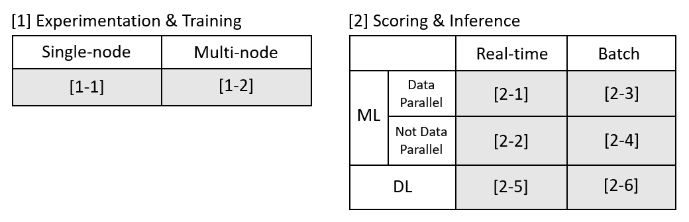

# Custom AI on Azure
This repository is a collection of scripts and tutorials to help AI developers effectively use Azure for their AI workloads. In this repository, we explore several key paths when developing custom AI on Azure. Each path will provide infrastructure guidance, scripts for deployment, and tutorials to educate readers in a step-by-step fashion.

## Learning Paths
The learning paths below reflect guides on best practices for developing custom AI on Azure. While the learning paths below do not capture all possible options for each scenario, the below paths represent our general recommendation for the generic case.

### [1] Experimentation & Training
When developing your model, you want to optimize your experience around the ability to experiment and train your models, while maintaining as much flexibility as possible without locking yourself into any particular toolkit. The following is segmented into running your experimentation and training workloads on a single-node vs multiple-nodes, each remaining agnostic to the type of work your doing.

[__[1-1] Single-node training/experimentation__](1-1)

In the most basic scenario for training and experimentation, AI developers come to Azure with the goal of building out a model that they can eventually put into production. Often times, with these models can be developed on a single machine, with the option of parallelizing across the multiple cores on a single VM. 

This learning path shows you how to set up an Azure DSVM so that you can run R or Python code and start working on building your model in the cloud.

Technologies: [Azure DSVM](TODO)

[__[1-2] Multi-node training/experimentation__](1-2)

Sometimes, training and experimentation workloads are slowed down because of the limitations of running on a single machine. In order to accelerate model development, and help AI developers to more easily run more tests, AI developers may want to expand their compute surface to span multiple nodes. This not only helps users to speed up their testing, but also gives them the opportunity to use larger datasets.

This learning path shows you how to set up an interactive session with BatchAI so that you can run your experiments and training workloads at scale in the cloud.

Technologies: [BatchAI](TODO)

### [2] Scoring & Inference
Scoring and Inferencing workloads are setup to bring a model into production. This section pivots on ML vs DL, data-parallel vs not-data-parallel, and real-time vs batch. These pivots were selected because they have implications the infrastructure you use in Azure.

[__[2-1] Real-time scoring with machine learning models__](2-1)
This learning path shows you how to set up AML so that you can score your machine learning models in real-time. Often times, scoring of machine learning models takes in some form of structured data as input, thus the networking and compute requirements are relatively small, making AML an ideal platform to score your models with.

Technologies: [AML](TODO)

[__[2-2] Batch scoring with machine learning models__](2-2)
This learning path shows you how to set up Batch AI so that you can run batch scoring jobs on your machine learning models. For many scenarios, it is common to do a batch scoring job across all new data so that the results can be used the next day.

Technologies: [BatchAI](TODO)

[__[2-3] Real-time scoring with machine learning models with high data parallelism__](2-3)
TODO

[__[2-4] Batch scoring with machine learning models with high data parallelism__](2-4)
This learning path shows you how to set up AZTK (Azure Distributed Data Engineering Toolkit) so that you can create on-demand Spark clusters for batch scoring/inferencing jobs.

Technologies: [AZTK](TODO)

[__[2-5] Real-time scoring with deep learning models__](2-5)
This learning path shows you how to set up AKS (Azure Kubernetes Service) so that you can provision Kubernetes clusters for performing high-throughput scoring in real-time. Because AKS can be set up with GPUs, this configuration will enable high throughput with low latency, providing you a powerful platform for real-time scoring.

Technologies: [AKS](TODO)

[__[2-6] Batch scoring with deep learning models__](2-6)
This learning path shows you how to set up a BatchAI cluster on-demand so that you can perform large-scale batch scoring and inferencing jobs. BatchAI takes advantage of low-priority VMs which helps you work through large datasets at a low cost.

Technologies: [BatchAI](TODO)

## FAQ: What and Why?

__What is Custom AI on Azure?__

Today in Azure, there are a myriad of tools and services that were designed for AI workloads. However, for a data scientist new to Azure, there are several entry points where on can start to develop and eventually deploy their AI solutions. 

| Tier | Customizability | Audience | Services |
|---|---|---|---|
| Highest | Limited | Developers | Cognitive Services, Azure Search, Bot Framework |
| **Middle** | **Flexible** | **AI Developers** | **AML, DSVM/DLVM, AZTK, BatchAI, AKS, Azure Functions, Data Factory** |
| Lowest Tier | Maximal | IT | Compute, Network, Storage |

This toolkit focuses on the middle tier illustrated in the table above.

__Why use Custom AI on Azure?__

Customers can choose to use Azure at any layer of the stack. Each layer has its own mix of benefits and limitations. 

Generally speaking, users may want to use the Custom AI on Azure because they want to build their AI solution on flexible & customizable way, yet not have to worry about managing their infrastructure. Additionally, many of the tools and services in the Custom AI on Azure stack tends to be more generally available (across regions) and often adheres to higher compliance and security requirements. 

| | Pure IaaS | Custom AI on Azure Stack | Cognitive Services | 
| --- | --- | --- | --- |
| Compliance & Security | Mature | Mature | Less Mature |
| Costs | Low | Low | High |
| Flexibility & Customizibility | High | High | Low |
| Availability | Mature | Mature | Less Mature |

*The table above compares the categories in a general sense. Individual services or tools belonging to each category may not strictly adhere to the table above.

## Contributing 

This project welcomes contributions and suggestions.  Most contributions require you to agree to a
Contributor License Agreement (CLA) declaring that you have the right to, and actually do, grant us
the rights to use your contribution. For details, visit https://cla.microsoft.com.

When you submit a pull request, a CLA-bot will automatically determine whether you need to provide
a CLA and decorate the PR appropriately (e.g., label, comment). Simply follow the instructions
provided by the bot. You will only need to do this once across all repos using our CLA.

This project has adopted the [Microsoft Open Source Code of Conduct](https://opensource.microsoft.com/codeofconduct/).
For more information see the [Code of Conduct FAQ](https://opensource.microsoft.com/codeofconduct/faq/) or
contact [opencode@microsoft.com](mailto:opencode@microsoft.com) with any additional questions or comments.
